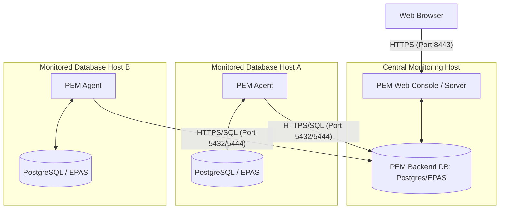

# EDB Postgres Enterprise Manager (EDB PEM): Deep Dive & Learning Guide

EDB Postgres Enterprise Manager (PEM) is an enterprise-grade monitoring, management, and tuning platform designed specifically for PostgreSQL and EDB Postgres Advanced Server (EPAS) deployments. Built on top of the open-source **pgAdmin 4** project, PEM extends it with advanced multi-server monitoring, historical metrics storage, alert dispatching, and automated tuning wizards.

## Directory Files & Automation

This folder contains a fully containerized lab setup to experiment with and run EDB PEM:

*   **[docker-compose.yml](file:///home/josef/github.com/josmac69/postgresql_support_docs/EDB_PEM/docker-compose.yml)**: Sets up the EDB PEM Server web console container, backend database, and monitored Postgres nodes.
*   **[Dockerfile](file:///home/josef/github.com/josmac69/postgresql_support_docs/EDB_PEM/Dockerfile)**: Defines the custom container image for the PEM server or client runtime.
*   **[Makefile](file:///home/josef/github.com/josmac69/postgresql_support_docs/EDB_PEM/Makefile)**: Automates cluster boot, initialization, agent configuration, and cleanup.
*   **[init-pem-db.sql](file:///home/josef/github.com/josmac69/postgresql_support_docs/EDB_PEM/init-pem-db.sql)**: Database initialization script for the backend PEM database.
*   **[pem_agent.py](file:///home/josef/github.com/josmac69/postgresql_support_docs/EDB_PEM/pem_agent.py)**: Python wrapper utility to automatically register local PEM agents.

---

## 1. Core Architecture

PEM follows a classic agent-server architecture:



### The Four Pillars of PEM

1.  **PEM Web Console:** The web application that provides the graphical user interface. This is where DBA administrators view dashboards, write queries, manage configurations, and trigger actions.
2.  **PEM Backend Database:** A standard Postgres or EPAS instance hosting the `pem` schema. It stores configuration data, historical metrics, alert logs, and execution schedules.
3.  **PEM Agent:** A C++ process installed on each monitored database host. The agent is responsible for executing probes, monitoring system logs, collecting operating system statistics, and writing them back to the PEM Backend Database.
4.  **Monitored Database Instances:** The target database servers (community Postgres or EPAS) that are bound to an active PEM Agent.

---

## 2. Key Monitoring Concepts: Probes & Alerts

### Probes (Metrics Collection)
A **probe** is a scheduled task that gathers specific metrics. Probes can query SQL tables or execute OS-level commands.
- **System Probes:** Track CPU utilization, memory usage, disk IO, and network traffic.
- **Database Probes:** Query `pg_stat_database`, `pg_stat_activity`, locks, WAL generation rates, and replication lag.
- **Execution:** The PEM Server schedules probes. The PEM Agent downloads the list of tasks, executes them locally against the target DB/host, and pushes the results back to the central database.
- **Custom Probes:** Administrators can write custom SQL scripts to track application-specific metrics.

### Alerting Engine
PEM evaluates probe data against pre-defined thresholds.
- **Alert Levels:** `OK` (Green), `Warning` (Yellow), and `Critical` (Red).
- **Default Alerts:** Out-of-the-box alerts check for connection counts, lock counts, server crashes, disk full conditions, and excessive replication lag.
- **Notifications:** Alerts can trigger emails, SNMP traps, or execute custom scripts (e.g., calling an API endpoint or triggering a paging system).

---

## 3. Administrative Workflows

### Agent Registration
To monitor a new host, you install the EDB PEM Agent package and register it against the central PEM Server:

```bash
/usr/edb/pem/agent/bin/pemagent \
  --register-agent \
  --pem-server pem-server-db.local \
  --pem-port 5432 \
  --pem-user postgres \
  --pem-database pem \
  --display-name "production-db-node-1" \
  --force-registration
```

During registration:
1. The agent establishes a connection to the central PEM database.
2. It registers its display name and retrieves a unique `agent_id`.
3. It generates an `agent.cfg` configuration file.
4. An SSL certificate is generated to secure future communication between the agent and the database.

---

## 4. Built-in Enterprise Wizards & Tools

PEM includes several specialized tools that set it apart from standard pgAdmin:

| Tool | Purpose |
| :--- | :--- |
| **SQL Profiler** | Traces SQL statements executed on a database. It helps DBAs pinpoint slow-running queries and analyze execution plans. |
| **Tuning Wizard** | Analyzes system resources (RAM, CPU, storage type) and recommends changes to `postgresql.conf` parameters (e.g., `shared_buffers`, `work_mem`) based on workload type (OLTP, OLAP, Mixed). |
| **Audit Manager** | Configures database auditing rules. It tracks user logins, connections, and specific SQL queries (DDL, DML) to satisfy compliance audits (HIPAA, PCI-DSS). |
| **EFM Integration** | Integrates with EDB Failover Manager. DBAs can visually inspect cluster health, failover states, and trigger manual switchovers from the PEM UI. |
| **Log Manager** | Configures and aggregates database log files on the target server. It formats them for centralized analysis inside the PEM dashboard. |

---

## 5. Scaling and Performance Tuning the PEM Server

Because a single PEM Server can monitor hundreds of databases, the PEM Backend Database handles a high volume of write traffic.
- **Partitioning:** PEM automatically partitions historical metrics tables (by day/week) to maintain search performance and allow easy retention pruning.
- **Probe Frequency Tuning:** If performance degrades, DBAs should increase the collection intervals (e.g., checking disk space every 10 minutes instead of every 30 seconds).
- **Backend Storage:** Place the EDB PEM database on fast SSD storage (NVMe preferred) with optimized disk configurations (separate tablespaces for data and indexes).
