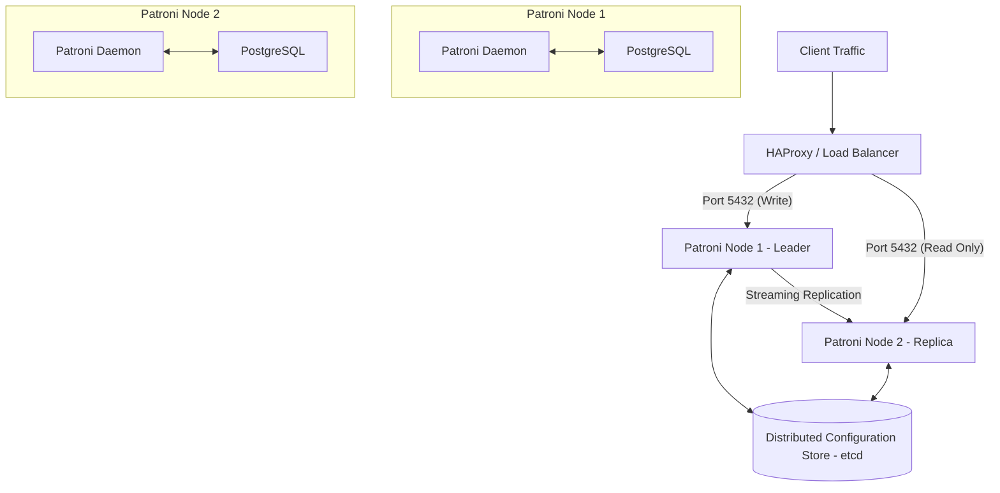

# Patroni: Deep Dive & Learning Guide

Patroni is an open-source template for building customized High Availability (HA) PostgreSQL solutions. It uses a Distributed_Configuration_Store_DCS such as **etcd**, **Consul**, or **ZooKeeper** to coordinate cluster state and manage leader election, failover, and configuration distribution.

This guide details the core concepts, architecture, operations, and troubleshooting workflows you need to master Patroni.

---

## 1. Core Architecture

### The Patroni Controller
Patroni runs as a daemon (controller process) on the same host/container as the PostgreSQL instance. It is responsible for:
- Bootstrapping the PostgreSQL instance.
- Communicating with the DCS to maintain the cluster state and hold/renew the leader lease.
- Monitoring the local PostgreSQL process.
- Dynamically updating PostgreSQL configuration (`postgresql.conf`, `pg_hba.conf`).
- Running custom scripts or commands during lifecycle transitions (e.g., post-promote, post-bootstrap).

### Distributed_Configuration_Store_DCS
PostgreSQL lacks a built-in mechanism to agree on which node is the master (leader) across a network. Patroni solves this by outsourcing state agreement to a DCS like `etcd`. 
- **The Key-Value Path:** Inside the DCS, Patroni maintains a directory structure under `/service/<scope_name>/` (e.g., `/service/my-cluster/`).
- **The Leader Key:** The node holding the leader lease writes its node name to `/service/<scope_name>/leader` with a Time-To-Live (TTL).
- **Consensus:** Because the DCS enforces strong consistency, only one node can write to the `/leader` key at a time. This guarantees that **split-brain** (two masters accepting writes) is mathematically impossible.

---

## 2. Key Operational Concepts

### The Heartbeat Loop & TTL
1. **Loop Wait:** Every `loop_wait` seconds (default: 10s), the Patroni daemon checks the local PostgreSQL status.
2. **Lease Renewal:** If the local node is the leader and Postgres is healthy, Patroni refreshes the lease in the DCS. The lease is valid for `ttl` seconds (default: 30s).
3. **Failover Trigger:** If the leader node crashes or network partition occurs, it fails to renew the lease. Once the `ttl` expires, other replicas notice the empty `/leader` key and attempt to acquire it.
4. **Acquire Limit:** Replicas will only try to acquire the leader key if their replication lag is within acceptable limits (calculated via `retry_timeout`).

### Switchover vs. Failover
- **Switchover (Planned):** A clean transition initiated by the administrator (e.g., using `patronictl switchover`). The leader demotes itself, waits for replication stream to catch up on replicas, writes a transition key to the DCS, and allows a chosen replica to promote safely. Data loss is zero.
- **Failover (Unplanned):** The leader node crashes. The DCS lease expires. The replica with the most advanced WAL position is elected as the new leader and promoted. Since the old master crashed, there might be minimal data loss (if asynchronous replication is used).

### Split-Brain Mitigation
If a network partition isolates the leader from the DCS:
1. The leader cannot renew its lease, so it expires.
2. The remaining partition elects a new leader.
3. To prevent the isolated leader from accepting writes, Patroni enforces a rule: **If a leader loses connection to the DCS, it must immediately demote its local PostgreSQL instance to read-only mode** (or shut it down).

### `pg_rewind` Integration
When a crashed leader rejoins the cluster, its timeline might diverge from the new leader. 
- Patroni automatically uses `pg_rewind` to find the exact point where the old master's timeline split from the new master.
- It winds back the old master's data files to that point and configures it to replicate from the new leader, avoiding the need for a full `pg_basebackup` resync.

---

## 3. Important EDB Integration Points

EnterpriseDB (EDB) positions Patroni as a key HA solution alongside EDB Postgres Distributed (PGD).
- **TPA (Trusted Postgres Architect):** EDB's Ansible-based deployment orchestrator configures and deploys Patroni-managed clusters out-of-the-box.
- **pg_hba Management:** Patroni manages authentication mappings inside `pg_hba.conf` dynamically. When adding nodes or load balancers, configuration updates are synced cluster-wide.
- **Failover Manager (EFM) Comparison:** While EFM uses a custom coordinator Java agent, Patroni is the modern cloud-native standard that integrates seamlessly into Kubernetes environments (e.g., CloudNativePG utilizes the same operational principles).

---

## 4. Key Commands (`patronictl`)

The CLI utility `patronictl` is the primary interface for managing a Patroni cluster.

| Command | Description |
| :--- | :--- |
| `patronictl -c /path/to/patroni.yml list` | Displays the status of all nodes, replication role, state, and lag. |
| `patronictl -c /path/to/patroni.yml topology` | Shows the physical replication topology (who is replicating from whom). |
| `patronictl -c /path/to/patroni.yml show-config` | Prints the active cluster-wide configuration stored in the DCS. |
| `patronictl -c /path/to/patroni.yml edit-config` | Opens an interactive editor to change DCS configuration dynamically. |
| `patronictl -c /path/to/patroni.yml switchover` | Triggers a planned database master migration. |
| `patronictl -c /path/to/patroni.yml failover` | Forces a failover when the current leader is degraded. |
| `patronictl -c /path/to/patroni.yml restart <node>` | Safely restarts a Patroni node (pausing cluster monitoring momentarily). |
| `patronictl -c /path/to/patroni.yml pause` | Pauses Patroni monitoring, allowing manual maintenance without triggering automatic failovers. |
| `patronictl -c /path/to/patroni.yml resume` | Unpauses cluster monitoring. |

---

## 5. Troubleshooting Workflows

### Scenario A: Replica in "start_timeout" or "creating replica" state
- **Cause:** The replica is trying to perform the initial bootstrap clone (`pg_basebackup`) but failing.
- **Fix:** 
  1. Inspect Patroni daemon logs.
  2. Verify network connectivity from the replica to the leader on PostgreSQL port 5432.
  3. Ensure replication user credentials (`replicator` role) are correct in the config file.

### Scenario B: Split-Brain / Multiple Leaders
- **Cause:** Multiple etcd clusters or partition of etcd, allowing two separate leaders to think they hold the lease.
- **Fix:**
  1. Verify etcd cluster health (`etcdctl endpoint health`).
  2. Check `PATRONI_ETCD3_HOSTS` configuration to ensure all nodes talk to the exact same DCS cluster.

### Scenario C: PostgreSQL not starting after recovery
- **Cause:** Incompatible configuration or lock files remaining in data directory.
- **Fix:** Check PostgreSQL logs (`pg_log` or `journalctl`). Patroni redirects stdout/stderr of PostgreSQL to its own log stream, so grep the Patroni logs for `postgres` execution output.
