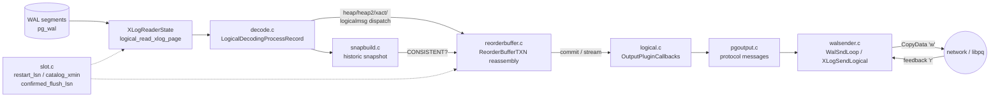
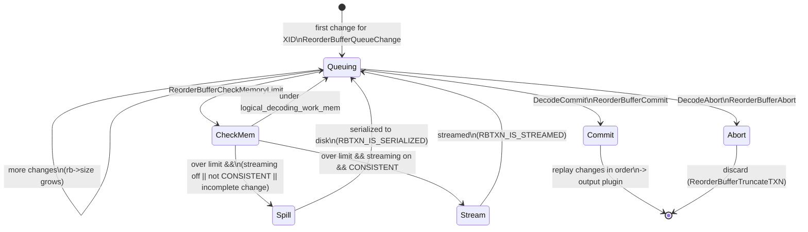
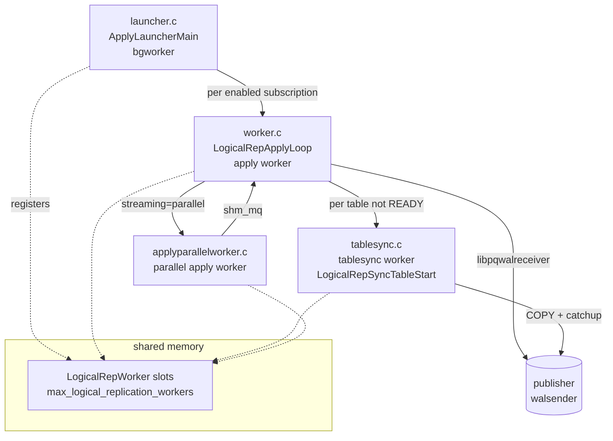
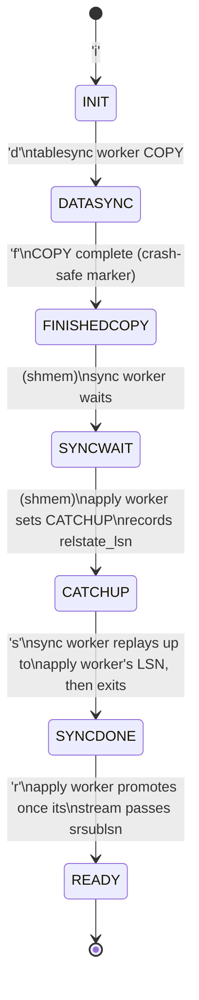
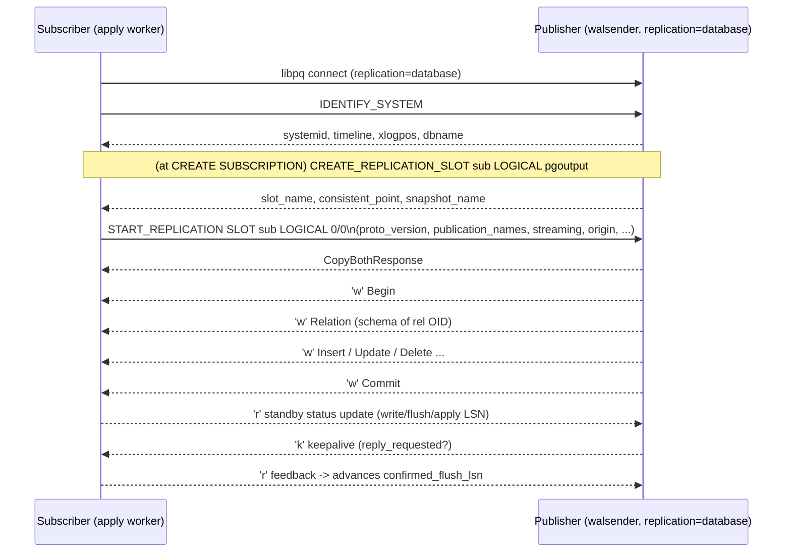

# PostgreSQL Logical Replication Internals: REL_18_STABLE Deep Dive and What Changed in REL_19_STABLE

## TL;DR

- **Part 1 (PG18):** Logical replication in REL_18_STABLE is a two-halves pipeline. The **sender** reads WAL through an `XLogReaderState`, dispatches records in `decode.c`, reassembles transactions in `reorderbuffer.c` (spilling to disk or streaming when `logical_decoding_work_mem` is exceeded), tracks catalog visibility via the `snapbuild.c` state machine (`START→BUILDING_SNAPSHOT→FULL_SNAPSHOT→CONSISTENT`), and emits protocol messages through `pgoutput.c` driven by `walsender.c` in logical mode. The **receiver** is a launcher (`launcher.c`) that spawns per-subscription apply workers (`worker.c`), which drive tablesync workers (`tablesync.c`) and parallel apply workers (`applyparallelworker.c`), applying changes through `ExecSimpleRelation*` executor entry points.
- **Part 2 (PG19):** The headline logical-replication changes in REL_19_STABLE are **sequence synchronization** (`FOR ALL SEQUENCES`, `ALTER SUBSCRIPTION ... REFRESH SEQUENCES`, a new `sequencesync` worker), **dynamic/online `wal_level`** (new read-only `effective_wal_level`, promotion to logical on first logical slot creation without restart), **`update_deleted` conflict detection** with the `retain_dead_tuples` subscription option and the internal `pg_conflict_detection` slot, `max_retention_duration`, **`CREATE PUBLICATION ... EXCEPT`**, and **`CREATE SUBSCRIPTION ... SERVER`** (postgres_fdw-based connection).
- **Critical version correction:** `retain_dead_tuples`, the `update_deleted` conflict type, and the `pg_conflict_detection` slot are **NOT in PG18**; PG18 ships only conflict *logging/statistics* (six conflict types, plus `multiple_unique_conflicts`). These conflict-detection features were committed to master during the PG19 cycle (commit 228c370868 on ~23 July 2025 and commit fd5a1a0c on 2025-08-04, Zhijie Hou / Amit Kapila) and ship in **PG19** (Beta 1 released June 4, 2026; GA expected September/October 2026).

---

# PART 1 — Logical Replication in REL_18_STABLE

Logical replication decomposes into a **publisher/sender** side (logical decoding of WAL into a change stream, transported by the walsender) and a **subscriber/receiver** side (background workers that apply the stream). The publisher requires `wal_level = logical` in PG18 — a `postmaster`-context GUC requiring restart (changed in PG19, see Part 2).

## 1. Sender Side

### 1.1 End-to-end sender pipeline



### 1.2 Logical decoding architecture (`logical.c`, `decode.c`, `logicalfuncs.c`)

The core object is the **`LogicalDecodingContext`** (`src/include/replication/logical.h`), created by `CreateInitDecodingContext()` (during `CREATE_REPLICATION_SLOT`) or `CreateDecodingContext()` (during `START_REPLICATION`). It bundles the `XLogReaderState` (with the `logical_read_xlog_page` page-read callback), the `ReorderBuffer`, the `SnapBuild`, the output-plugin callback table, and the writer callbacks (`prepare_write`, `write`, `update_progress`). `CreateInitDecodingContext()` calls `ReplicationSlotCreate()` (via walsender) and `AllocateSnapshotBuilder()`.

WAL records are fed one at a time to **`LogicalDecodingProcessRecord()`** in `decode.c`, which switches on the resource-manager ID of the record (`XLogRecGetRmid`) and dispatches:

- `heap_decode()` — `RM_HEAP_ID`: INSERT/UPDATE/DELETE/TRUNCATE (`XLOG_HEAP_INSERT`, `XLOG_HEAP_UPDATE`, `XLOG_HEAP_DELETE`, etc.), building `ReorderBufferChange` records.
- `heap2_decode()` — `RM_HEAP2_ID`: `XLOG_HEAP2_MULTI_INSERT` (COPY), `XLOG_HEAP2_NEW_CID` (catalog-modifying command IDs used to build catalog snapshots), and `XLOG_HEAP2_LOCK` etc.
- `xact_decode()` — `RM_XACT_ID`: commit/abort/prepare records (`XLOG_XACT_COMMIT`, `XLOG_XACT_ABORT`, `XLOG_XACT_PREPARE`, `XLOG_XACT_COMMIT_PREPARED`, `XLOG_XACT_ASSIGNMENT`), driving `DecodeCommit()`, `DecodeAbort()`, `DecodePrepare()`.
- `standby_decode()` — `RM_STANDBY_ID`: `XLOG_RUNNING_XACTS` (`xl_running_xacts`), which drives the snapshot builder.
- `logicalmsg_decode()` — `RM_LOGICALMSG_ID`: `XLOG_LOGICAL_MESSAGE` (from `pg_logical_emit_message()`).

Only records that carry the logical-decoding marker (transactions that touched catalogs get a `NEW_CID`; DML on published tables is emitted with enough info because `wal_level = logical` includes REPLICA IDENTITY data) are relevant. Each decode routine checks `SnapBuildProcessChange()` / `SnapBuildXactNeedsSkip()` to decide whether the change is past the consistent point.

### 1.3 The reorder buffer (`reorderbuffer.c`)

WAL is physically interleaved across concurrent transactions; logical decoding must present each transaction's changes contiguously and in commit order. The **`ReorderBuffer`** does this reassembly. Each transaction is a **`ReorderBufferTXN`** (keyed by XID), holding a `dlist` of **`ReorderBufferChange`** entries, subtransaction linkage, the base snapshot, invalidation messages, and tuplecids. Top-level transactions are linked in `toplevel_by_lsn`.

**Memory accounting and the spill/stream decision.** Historically (pre-PG13) the buffer kept only `max_changes_in_memory` (4096) changes per transaction in memory. Since PG13, `ReorderBufferCheckMemoryLimit()` tracks total memory (`rb->size`) against **`logical_decoding_work_mem`**. When the limit is exceeded it picks the **largest** transaction (via a pairing heap, `ReorderBufferLargestTXN`/`txn_heap`) and either:

- **Spills to disk** (`ReorderBufferSerializeTXN()`), writing changes to `pg_replslot/<slot>/xid-*.spill` files, marking the TXN `RBTXN_IS_SERIALIZED`; restored later by `ReorderBufferRestoreChanges()`; or
- **Streams** the in-progress transaction to the output plugin (`ReorderBufferStreamTXN()`), if the subscriber negotiated streaming (protocol v2+) and the snapshot has reached `SNAPBUILD_CONSISTENT`. Streaming was added in PG14 (commit 45fdc9738b). Incomplete changes (partial TOAST, speculative inserts) still force a spill until the tuple is complete.



**Statistics** are accumulated in the `ReorderBuffer` (`spillTxns`, `spillCount`, `spillBytes`, `streamTxns`, `streamCount`, `streamBytes`, `totalTxns`, `totalBytes`, and the `memExceededCount` counter) and flushed to `pg_stat_replication_slots` via `UpdateDecodingStats()` (called from `DecodeCommit`/`DecodeAbort`/`DecodePrepare` and the serialize/stream paths).

**TOAST reconstruction.** Out-of-line TOAST chunks are logged separately; the reorder buffer accumulates them per-TXN and reassembles the full datum at replay via `ReorderBufferToastReplace()` before the change reaches the plugin, then cleans up with `ReorderBufferToastReset()`.

**Subtransactions and aborts.** Subxacts are associated with their top-level XID via `XLOG_XACT_ASSIGNMENT` records and `ReorderBufferAssignChild()`. At commit the subxact change-streams are merged in LSN order. Aborted (sub)transactions are discarded via `ReorderBufferTruncateTXN()`. In PG18, `ReorderBufferCheckTXNAbort()` (introduced with commit 072ee847, "skip logical decoding of already-aborted transactions") checks the CLOG so that changes of a transaction already known aborted are not collected — a meaningful efficiency win. When streaming in-progress transactions, catalog scans can hit an in-progress abort; those raise `ERRCODE_TRANSACTION_ROLLBACK` and the current transaction's decoding is abandoned.

### 1.4 Historic snapshot building (`snapbuild.c`)

Logical decoding needs a **historic MVCC snapshot** to read the system catalogs *as they were* when each change was made (so `pg_attribute`/`pg_class` reflect the right column types). The **`SnapBuild`** structure runs a state machine advanced by `xl_running_xacts` records:

```mermaid
stateDiagram-v2
    [*] --> SNAPBUILD_START
    SNAPBUILD_START --> SNAPBUILD_BUILDING_SNAPSHOT: first xl_running_xacts\nrecord seen; record nextXid
    SNAPBUILD_BUILDING_SNAPSHOT --> SNAPBUILD_FULL_SNAPSHOT: all xacts running at\nprevious record have ended
    SNAPBUILD_FULL_SNAPSHOT --> SNAPBUILD_CONSISTENT: another full generation\nof xacts has ended
    SNAPBUILD_CONSISTENT --> [*]: DecodingContextReady\ndecode changes to plugin
```



Key mechanics: In `START`, when the first `xl_running_xacts` with running XIDs arrives, `SnapBuildFindSnapshot()` records `xl_running_xacts->nextXid` and transitions to `BUILDING_SNAPSHOT`. Because a transaction "running" in the record may already have inserted its commit record, PostgreSQL must wait for **two** subsequent `xl_running_xacts` such that the second contains none of the XIDs from the first (commit 955a684e040 fixed the original single-record bug). Committed catalog-modifying transactions are tracked in `SnapBuild->committed` and `SnapBuild->catchange`. Once `CONSISTENT`, `SnapBuildBuildSnapshot()` produces snapshots usable to decode changes. `SnapBuildExportSnapshot()` / `SnapBuildInitialSnapshot()` export a snapshot for the initial data COPY (used by tablesync).

**Serialization.** To avoid rebuilding from scratch on reconnect, snapshots are serialized to `pg_logical/snapshots/<lsn>.snap` via `SnapBuildSerialize()` (with a CRC-checked `SnapBuildOnDisk` header) and restored by `SnapBuildRestore()`. `initial_xmin_horizon` bounds how far back decoding may start.

### 1.5 Replication slots (`slot.c`, `slotsync.c`)

A **logical replication slot** (`ReplicationSlot`, persisted under `pg_replslot/`) is the durable cursor and resource-retention anchor. Its logical-specific fields:

- **`restart_lsn`** — oldest WAL still needed for decoding (where the walsender begins reading; `WalSndLoop` starts at `MyReplicationSlot->data.restart_lsn`). Advanced conservatively via `LogicalIncreaseRestartDecodingForSlot()`.
- **`confirmed_flush_lsn`** — LSN the subscriber has confirmed flushed; changes below it need never be resent.
- **`catalog_xmin`** / **`effective_catalog_xmin`** — oldest transaction whose catalog rows must be retained so historic snapshots remain valid; this holds back VACUUM on catalogs.
- **`data.two_phase`**, **`data.failover`**, **`data.synced`** — two-phase decoding enabled, failover-slot flag, and "this slot is synced from a primary" flag.

**Slot invalidation** (`InvalidateObsoleteReplicationSlots()`, reasons enumerated as `RS_INVAL_*`): `wal_removed` (required WAL segments removed under `max_slot_wal_keep_size`), `rows_removed` (required catalog rows vacuumed away — relevant for slots on standbys), `wal_level_insufficient`, and, **new in PG18**, `idle_timeout` (`RS_INVAL_IDLE_TIMEOUT`). PG18's `idle_replication_slot_timeout` GUC (default 0 = disabled, unit seconds, `sighup` context) invalidates a slot that has been inactive longer than the configured duration; invalidation happens at the next **checkpoint**, using `pg_replication_slots.inactive_since`. It applies only to released (inactive) slots that reserve WAL, and never to slots being synced on a standby. (Note the rounding quirk raised on pgsql-hackers: sub-minute values may effectively round to 0.)

**Failover slots and slot synchronization (`slotsync.c`).** A logical slot created with `failover = true` can be synchronized to a physical standby so that, after failover/promotion, subscribers can continue from the new primary. On the standby, either the built-in **slot sync worker** (enabled by `sync_replication_slots = on`) or the SQL function `pg_sync_replication_slots()` copies slot state (`restart_lsn`, `catalog_xmin`, `confirmed_flush_lsn`, `two_phase`) into local synced slots. The GUC `synchronized_standby_slots` ensures logical walsenders do not send changes to subscribers before the listed physical standbys have confirmed receipt (via `StandbySlotsHaveCaughtup()`), preventing the subscriber from getting ahead of a standby that might become primary. **Logical decoding on standbys** is supported (since PG16): a standby can host logical slots, with the `rows_removed`/`wal_level_insufficient` invalidation logic protecting correctness when the primary vacuums or lowers `wal_level`.

### 1.6 The walsender in logical mode (`walsender.c`)

`START_REPLICATION SLOT <name> LOGICAL <lsn> [ (options) ]` enters `StartLogicalReplication()`, which calls `CreateDecodingContext()` with `logical_read_xlog_page` as the page-read callback and `WalSndPrepareWrite`/`WalSndWriteData`/`WalSndUpdateProgress` as writer callbacks, seeks the reader to `restart_lsn` (`XLogBeginRead`), sets `sentPtr = confirmed_flush`, and enters **`WalSndLoop(XLogSendLogical)`**.

**`XLogSendLogical()`** reads the next record (`XLogReadRecord`) and calls `LogicalDecodingProcessRecord()`, which ultimately drives the output plugin, whose writes become CopyData `'w'` messages on the wire. `logical_read_xlog_page()` calls `WalSndWaitForWal()` to block until enough WAL is flushed, then (since logical decoding is permitted on standbys) checks `RecoveryInProgress()` — setting `am_cascading_walsender` — and resolves the correct timeline via `XLogReadDetermineTimeline()` (using `GetXLogReplayRecPtr()` on a standby or `GetWALInsertionTimeLine()` on a primary).

**Keepalives and flow control.** The loop sends keepalive `'k'` messages (via `WalSndKeepalive`) and honors `wal_sender_timeout`. The subscriber replies with **standby status update** `'r'` feedback messages carrying `write`, `flush`, and `apply` LSNs; `ProcessStandbyReplyMessage()` records these and calls `LogicalConfirmReceivedLocation()` to advance `confirmed_flush_lsn` (and thus permit `restart_lsn`/`catalog_xmin` advancement, releasing WAL and catalog rows).

### 1.7 Output plugin interface (`logical.c` + `OutputPluginCallbacks`)

The plugin contract is the **`OutputPluginCallbacks`** struct: `startup_cb`, `begin_cb`, `change_cb`, `truncate_cb`, `commit_cb`, `message_cb`, `filter_by_origin_cb`, `shutdown_cb`; two-phase callbacks `begin_prepare_cb`, `prepare_cb`, `commit_prepared_cb`, `rollback_prepared_cb`, `stream_prepare_cb`; and streaming callbacks `stream_start_cb`, `stream_stop_cb`, `stream_abort_cb`, `stream_commit_cb`, `stream_change_cb`, `stream_message_cb`, `stream_truncate_cb`. Plugins register these in `_PG_output_plugin_init()`. `OutputPluginPrepareWrite()`/`OutputPluginWrite()` frame each message for the writer.

Two-phase decoding (protocol v3+) emits `PREPARE`/`COMMIT PREPARED`/`ROLLBACK PREPARED` at the corresponding WAL records via `DecodePrepare()`; streaming (v2+/v4) emits `stream_*` for in-progress transactions (e.g., `pgoutput_stream_prepare_txn()` writes `logicalrep_write_stream_prepare`).

### 1.8 pgoutput specifics (`pgoutput.c`)

`pgoutput` is the built-in plugin used by native subscriptions. It reads options via `START_REPLICATION SLOT ... LOGICAL`: `proto_version`, `publication_names`, `binary`, `messages`, `streaming` (off/on/parallel), `two_phase`, `origin`.

**Protocol versions:** v1 (base), **v2** (server ≥14, streaming of large in-progress transactions), **v3** (server ≥15, two-phase), **v4** (server ≥16, parallel-apply-capable streaming — extra info in some messages). `streaming=parallel` requires v4. Both `proto_version` and `publication_names` are mandatory.

**Message types:** `Begin` / `Commit`; `Origin`; `Relation` (schema/metadata for a relation OID, resent when the definition changes); `Type`; `Insert` / `Update` / `Delete`; `Truncate`; `Message` (logical messages); and the streaming/two-phase set `Stream Start`, `Stream Stop`, `Stream Commit`, `Stream Abort`, `Begin Prepare`, `Prepare`, `Commit Prepared`, `Rollback Prepared`, `Stream Prepare`. The `Origin` message (present in cascaded setups) always precedes DML in a transaction. Each DML message carries the publisher relation OID, and a `Relation` message precedes the first DML for that OID.

**Row filters and column lists.** `pgoutput` maintains a per-relation cache (`RelationSyncEntry`) that caches the compiled **row filter** expression and **column list** for each publication. (Note the PG18.x bug fix for a use-after-free in this cache reachable when pgoutput is invoked via SQL functions.) Row filters (`WHERE` clauses in `CREATE PUBLICATION ... WHERE (...)`) are evaluated per row in `pgoutput_row_filter()`; for UPDATE the old and new tuples are both tested and the operation may be transformed (INSERT/UPDATE/DELETE) depending on which rows match. Column lists restrict which columns are sent. `publish_generated_columns` (new in PG18) controls whether STORED generated columns are published when no explicit column list is present. `publish_via_partition_root` controls whether partitioned-table changes are published as the root table or the leaf partitions.

### 1.9 Publications (catalogs and semantics)

Publications are represented in **`pg_publication`** (with `puballtables`, `pubinsert`, `pubupdate`, `pubdelete`, `pubtruncate`, `pubviaroot`, and the PG18 `pubgencols`), **`pg_publication_rel`** (per-table membership, holding the row-filter `prqual` and column list `prattrs`), and **`pg_publication_namespace`** (for `FOR TABLES IN SCHEMA`). `FOR ALL TABLES` sets `puballtables`. The `publish` option selects which operations replicate.

**REPLICA IDENTITY and old-tuple decoding.** For UPDATE/DELETE the publisher must log enough to identify the target row on the subscriber. `REPLICA IDENTITY DEFAULT` logs the primary key columns as the "old key"; `FULL` logs the entire old tuple; `USING INDEX` logs a chosen unique index's columns; `NOTHING` forbids UPDATE/DELETE on published tables. In `decode.c`/`pgoutput`, UPDATE emits an optional old-key/old-tuple section plus the new tuple; DELETE emits only the identifying old key (or full old tuple under `FULL`). Using `FULL` significantly increases WAL volume, which is why the docs warn about it.

## 2. Receiver Side

### 2.1 Receiver architecture



### 2.2 The logical replication launcher (`launcher.c`)

The launcher is a postmaster-registered background worker (`ApplyLauncherRegister()` at startup). Its main loop **`ApplyLauncherMain()`** scans `pg_subscription` for enabled subscriptions and, for each that lacks a running leader apply worker, calls `logicalrep_worker_launch()` to start one, subject to `max_logical_replication_workers` (default 4). Worker bookkeeping lives in a shared-memory array of **`LogicalRepWorker`** slots (`LogicalRepCtx`), protected by `LogicalRepWorkerLock`. Restart throttling uses `wal_retrieve_retry_interval` so a repeatedly failing worker is not respawned faster than that interval. The launcher also handles `max_sync_workers_per_subscription` (default 2) and (`streaming=parallel`) `max_parallel_apply_workers_per_subscription` (default 2) accounting — all drawn from the `max_logical_replication_workers` pool, itself a subset of `max_worker_processes`. Subscription origin tracking is bounded by `max_active_replication_origins` (default 10, split out from `max_replication_slots` in PG18).

### 2.3 The apply worker (`worker.c`)

A leader apply worker connects to the publisher via **`libpqwalreceiver`** (`walrcv_connect`, `walrcv_startstreaming`), sets up its replication origin (`replorigin_session_setup`), fetches the origin's progress (`replorigin_session_get_progress`), and enters **`LogicalRepApplyLoop()`**. The loop calls `walrcv_receive()`, and on a `'w'` CopyData message calls `apply_dispatch()`, which switches on the message type byte:

- `'B'` → `apply_handle_begin`; `'C'` → `apply_handle_commit`
- `'I'` → `apply_handle_insert` → `ExecSimpleRelationInsert`
- `'U'` → `apply_handle_update` → `ExecSimpleRelationUpdate` (finds the local tuple via `RelationFindReplTupleByIndex`/`...SeqScan`)
- `'D'` → `apply_handle_delete` → `ExecSimpleRelationDelete`
- `'T'` → `apply_handle_truncate`
- `'R'` → `apply_handle_relation` (cache relation metadata in `LogicalRepRelMap`)
- `'M'` → logical message; `'O'` → origin; `'k'` → keepalive → `send_feedback`
- streaming set: `'S'`/`'E'`/`'A'`/`'c'`/stream-change messages
- two-phase: begin-prepare/prepare/commit-prepared/rollback-prepared

Changes are applied through the **`ExecSimpleRelation*`** helpers (low-level executor entry points that build an `EState`, open indexes, and fire triggers). By default only replica triggers fire; `session_replication_role = replica` is set so ordinary triggers/rules are suppressed unless declared `ENABLE ALWAYS`/`REPLICA`.

**Origin tracking.** Each subscription owns a replication origin named `pg_<subid>`; at commit, `replorigin_session_origin_lsn`/`_timestamp` are set from the commit message and the origin's progress is persisted so the apply worker resumes at the right LSN after a crash. `pg_replication_origin_status` exposes progress. When a publisher transaction touches no subscribed table, `Begin`/`Commit` are still sent and the worker skips the commit bookkeeping (not in a transaction).

**Error handling.** `disable_on_error` (subscription option) causes the worker to disable the subscription rather than loop on a fatal apply error. **`ALTER SUBSCRIPTION ... SKIP (lsn = ...)`** sets `subskiplsn`; the apply worker skips the transaction with that finish LSN (used to step past a conflicting transaction); alternatively `pg_replication_origin_advance()` can move the origin past a finish LSN while the subscription is disabled. Apply-time filtering honors `origin=none` (do not apply changes that carry an origin — loop avoidance in bidirectional setups).

### 2.4 Table synchronization (`tablesync.c`)

Each subscribed table starts in **`SUBREL_STATE_INIT`** (`i`) in `pg_subscription_rel` (`srsubstate`). The leader apply worker launches one tablesync worker per not-yet-ready table (throttled by `wal_retrieve_retry_interval`, capped by `max_sync_workers_per_subscription`). The tablesync worker (`LogicalRepSyncTableStart`) creates a **temporary sync slot** on the publisher (`ReplicationSlotNameForTablesync`), exports its snapshot (`CRS_USE_SNAPSHOT`), performs the initial **COPY** (`copy_table`, using `COPY ... TO STDOUT` over the protocol), then hands off to catch-up. It uses the slot name (not the subscription name) as `application_name` so synchronous replication can distinguish it from the leader.



`SUBREL_STATE_SYNCWAIT` and `SUBREL_STATE_CATCHUP` live only in shared memory (`LogicalRepWorker->relstate`); `INIT`/`DATASYNC`/`FINISHEDCOPY`/`SYNCDONE`/`READY` are persisted in the catalog. The handoff (`process_syncing_tables_for_sync`/`process_syncing_tables_for_apply`) is a two-worker rendezvous: the sync worker signals `SYNCWAIT`, the apply worker responds with `CATCHUP` and its current LSN, the sync worker replays remaining changes to exactly that LSN (or promotes straight to `READY` if `end_lsn == relstate_lsn`), sets `SYNCDONE`, and exits; the apply worker later flips `SYNCDONE → READY` once its own replay passes `srsublsn`. With `copy_data = false` the worker is launched straight to `READY` and exits immediately. `should_apply_changes_for_rel()` gates whether a given change is applied: a sync worker applies only its own relation, while the apply worker applies changes for `READY` relations and for `SYNCDONE` relations whose `statelsn` is below the change LSN.

### 2.5 Parallel apply (`applyparallelworker.c`)

With `streaming = parallel` (default in PG18 for new subscriptions; protocol v4), the leader apply worker (LA) does not serialize a large in-progress transaction to disk; instead, when the first `Stream Start` arrives, it assigns a **parallel apply worker (PA)** (`pa_allocate_worker`) and forwards changes over a dedicated shared-memory queue (**`shm_mq`**, `pa_send_data`). The PA applies changes as they arrive. The parallel apply worker inherits the leader's replication origin (`replorigin_session_setup(originid, MyLogicalRepWorker->leader_pid)`) rather than monopolizing it.

```mermaid
sequenceDiagram
    participant PUB as Publisher walsender
    participant LA as Leader apply worker
    participant PA as Parallel apply worker
    participant Q as shm_mq (ring buffer)
    PUB->>LA: Stream Start (xid)
    LA->>PA: assign worker (pa_allocate_worker)
    loop streamed changes
        PUB->>LA: Stream change (Insert/Update/Delete)
        LA->>Q: pa_send_data (non-blocking)
        Q->>PA: dequeue + apply (ExecSimpleRelation*)
    end
    Note over LA,Q: If shm_mq full past timeout:\nLA switches to PARTIAL_SERIALIZE,\nspills remaining changes to a file
    PUB->>LA: Stream Commit
    LA->>PA: notify commit; wait for PA to finish
    PA-->>LA: applied through commit (preserve commit order)
```

**Flow control / deadlock avoidance.** If the `shm_mq` buffer to a PA fills, the LA cannot block indefinitely (it must keep servicing other transactions), so it uses non-blocking writes with a timeout and, on timeout, switches to **partial serialization** (`PARTIAL_SERIALIZE`): remaining changes go to a file, and the PA reads them at end-of-transaction. At commit the LA waits for the PA to finish to **preserve commit order**, which is essential to avoid inter-transaction dependency violations (e.g., insert-then-update across two transactions). Because independent publisher transactions can become interdependent on the subscriber (e.g., a unique constraint the publisher lacks), the LA/PA use heavyweight locks to detect and resolve deadlocks between them, and can fall back to serialization. `debug_logical_replication_streaming` (`buffered`/`immediate`) forces either the shm_mq path or the serialize path for testing. (A PG18.x fix corrected a lock-timeout signal collision in parallel apply workers.)

### 2.6 Two-phase commit on the subscriber

With `two_phase = true`, the publisher decodes and sends `PREPARE`/`COMMIT PREPARED`/`ROLLBACK PREPARED`; the apply worker issues `PREPARE TRANSACTION`, so prepared transactions appear in `pg_prepared_xacts` on the subscriber and are finalized on the corresponding prepared/rollback message. The slot's `two_phase` property must be set; historically it could only be chosen at `CREATE SUBSCRIPTION`, but **PG18 allows `ALTER SUBSCRIPTION ... SET (two_phase = ...)`** to toggle it on a running subscription (Hayato Kuroda, Ajin Cherian, Amit Kapila, Zhijie Hou). Two-phase decoding interacts with the initial tablesync: prepared-transaction decoding must not begin before the initial sync consistent point. Two-phase requires `max_prepared_transactions > 0` on both ends.

### 2.7 Subscription DDL and catalogs

`pg_subscription` holds `subenabled`, `subconninfo`, `subslotname`, `subsynccommit`, `subpublications`, plus the option-backing columns: `subbinary`, `substream` (off `f`/on `t`/parallel `p`), `subtwophasestate`, `subdisableonerr`, `subpasswordrequired`, `subrunasowner`, `subfailover`, `suborigin`. `pg_subscription_rel` holds per-relation `srsubstate`/`srsublsn`. **PG18 subscription options:** `copy_data`, `origin` (none/any), `run_as_owner`, `password_required`, `streaming` (off/on/parallel, default parallel), `two_phase`, `failover`, `disable_on_error`, `binary`, `synchronous_commit`.

**Conflict logging and statistics (PG18).** PG18 logs replication conflicts and counts them in `pg_stat_subscription_stats` (Zhijie Hou, Nisha Moond). The conflict types are `insert_exists`, `update_origin_differs`, `update_exists`, `update_missing`, `delete_origin_differs`, `delete_missing`, and `multiple_unique_conflicts` (added by commit 73eba500). Log lines have the form `LOG: conflict detected on relation "...": conflict=<type>` with a DETAIL section giving key/local-row/remote-row/replica-identity and, when `track_commit_timestamp` is on, the origin and commit timestamp of the conflicting local row. UPDATE/DELETE on a missing row is a conflict that is *skipped* (not an error); unique-violation conflicts raise an error until resolved. **Note (see Part 2): `update_deleted` is NOT a PG18 conflict type** — detecting it requires retained dead tuples, which is a PG19 feature.

### 2.8 Monitoring views (PG18)

- **`pg_stat_replication`** — one row per walsender: `sent_lsn`, `write_lsn`, `flush_lsn`, `replay_lsn`, and the derived `write_lag`/`flush_lag`/`replay_lag`.
- **`pg_stat_replication_slots`** — decode stats per logical slot: `spill_txns`, `spill_count`, `spill_bytes`, `stream_txns`, `stream_count`, `stream_bytes`, `total_txns`, `total_bytes`.
- **`pg_replication_slots`** — `restart_lsn`, `confirmed_flush_lsn`, `catalog_xmin`, `wal_status`, `active`, `inactive_since`, `invalidation_reason`, `two_phase`, `failover`, `synced`.
- **`pg_stat_subscription`** — per apply/sync worker: `received_lsn`, `last_msg_send_time`, `latest_end_lsn`, etc.
- **`pg_stat_subscription_stats`** — apply-error and sync-error counts and the per-conflict-type counters (`confl_insert_exists`, `confl_update_origin_differs`, `confl_update_exists`, `confl_update_missing`, `confl_delete_origin_differs`, `confl_delete_missing`, `confl_multiple_unique_conflicts`).

### 2.9 Protocol handshake and message flow



---

# PART 2 — What Is New and Changed in REL_19_STABLE (PostgreSQL 19)

**Release status:** PostgreSQL 19 Beta 1 was released **June 4, 2026**; per the PostgreSQL Global Development Group's Beta 1 announcement, additional betas and "one or more release candidates" will follow "until the final release around September/October 2026." Everything below is committed in the master/REL_19_STABLE branch as of Beta 1 (feature freeze April 2026) unless explicitly flagged. Where the task asked to verify long-running patch series: **sequence synchronization landed**; **DDL replication did NOT land** (still absent in PG19).

## 2.1 Dynamic / online `wal_level` and `effective_wal_level`

The single biggest operational change: logical decoding no longer requires a server restart or a permanently elevated `wal_level`. Per the PostgreSQL 19 release notes, this was contributed by **Masahiko Sawada** ("When server variable `wal_level` is `replica`, allow the automatic enablement of logical replication when needed … New server variable `effective_wal_level` reports the effective WAL level."). When `wal_level = replica`, the server **automatically promotes the effective WAL level to `logical`** when the first logical replication slot is created, and demotes back to `replica` when the last logical slot is dropped or invalidated (demotion is asynchronous, performed by the checkpointer). A new **read-only GUC `effective_wal_level`** reports the level actually in effect. `wal_level` becomes a *floor*, and the effective level is `max(wal_level, what current slots require)`.

Operational caveats confirmed in the beta discussion: creating the first logical slot on a previously-`replica` system **blocks `CREATE_REPLICATION_SLOT` until the next checkpoint** (it must force a checkpoint so every writing backend observes the new level before starting the slot at a logical-safe LSN); on a busy system this can be tens of seconds, so slot-creation automation should raise its timeouts. Cascading physical standbys are unaffected (physical replay is level-agnostic).

## 2.2 Sequence synchronization

Logical replication can finally reproduce sequence state — closing the classic "promote the subscriber and the next INSERT collides with existing PKs" gap. This is **not continuous replication**; sequences are synced at well-defined moments only. Work led by **Vignesh C** with **Tomas Vondra** / Amit Kapila.

- **`CREATE PUBLICATION ... FOR ALL SEQUENCES`** (and `FOR ALL TABLES, ALL SEQUENCES`) — commit **96b37849734673e7c82fb86c4f0a46a28f500ac8**, committed by **Amit Kapila on 9 October 2025** (authors Vignesh C, Tomas Vondra), per depesz.com ("Add 'ALL SEQUENCES' support to publications"). `ALL SEQUENCES` can combine with `ALL TABLES` but not with granular `TABLE`/`TABLES IN SCHEMA` clauses. New view **`pg_publication_sequences`**; `\d` on a sequence shows publications; `\dRp` shows the all-sequences flag.
- **Sequence sync support** — commit **5509055d6956745532e65ab218e15b99d87d66ce**, committed by **Amit Kapila on 5 November 2025** (author Vignesh C), per depesz.com ("Add sequence synchronization for logical replication"). A new **`sequencesync` worker** (`SequencesyncWorkerMain`, a third `LogicalRepWorkerType` alongside apply and tablesync) batches sequences (`MAX_SEQUENCES_SYNC_PER_BATCH`), connects to the publisher, fetches current values via the new function **`pg_get_sequence_data()`**, advances subscriber sequences, and marks each `READY` in `pg_subscription_rel` (state `i`→`r`, same catalog used for tables). Mismatches are retried, not errored.
- Sync happens at **`CREATE SUBSCRIPTION`**, **`ALTER SUBSCRIPTION ... REFRESH PUBLICATION`** (also reconciles sequence existence — adds/drops), and **`ALTER SUBSCRIPTION ... REFRESH SEQUENCES`** (values only, not existence).

## 2.3 Publication and subscription DDL additions

- **`CREATE/ALTER PUBLICATION ... FOR ALL TABLES EXCEPT (TABLE ...)`** — exclude specific tables from a `FOR ALL TABLES` publication (Vignesh C, Shlok Kyal).
- **`CREATE SUBSCRIPTION ... SERVER`** — a subscription can reference a **postgres_fdw foreign server** (and user mapping) for its connection parameters instead of an inline `CONNECTION` string, simplifying credential management (**Jeff Davis**). A follow-up (commit 8eba2edb80102ac7d16c0335caca62e11adc8072, Jeff Davis, May 2026) fixed `ALTER SUBSCRIPTION ... SERVER` to check the publisher when `retain_dead_tuples` is set.

## 2.4 Conflict detection: `update_deleted`, `retain_dead_tuples`, `pg_conflict_detection`

This is the feature most likely to be mis-versioned. **It is a PG19 feature, not PG18.** The verified commit-level history:

- **Preserve conflict-relevant data during logical replication** — commit **228c370868**, author **Zhijie Hou (Fujitsu)**, committed by **Amit Kapila** (~23 July 2025, master/PG19). Introduced the **`retain_dead_tuples`** subscription option (catalog column `subretaindeadtuples`) and the internal **`pg_conflict_detection`** replication slot.
- **Detect and report update_deleted conflicts** — commit **fd5a1a0c** (fd5a1a0c3e566f7fc860838084466a1c25944281), author **Zhijie Hou (Fujitsu)**, committed by **Amit Kapila**, dated **2025-08-04** in the git log (per pgPedia's "PgPedia Week 2025-08-10"). When `retain_dead_tuples` is enabled it performs an additional `SnapshotAny` scan (`FindMostRecentlyDeletedTupleInfo`) to locate the recently-deleted (not yet vacuumed) tuple and report **`update_deleted`** (distinct from `update_missing`), including the deleting transaction's origin/commit timestamp.
- **Add max_retention_duration option to subscriptions** — commit **a850be2fe653b3b529969946c1cefe0fd9e34a8d**, Zhijie Hou / Amit Kapila (3 September 2025). Adds subscription option **`max_retention_duration`** (catalog columns `submaxconflretention` and `subretentionactive`); when the required retention exceeds the limit, dead-tuple retention is disabled (and re-enabled automatically when retention falls back below the limit).

**How it works:** `pg_conflict_detection` is a reserved slot **created and maintained by the logical replication launcher** (`CreateConflictDetectionSlot()` in `ApplyLauncherMain()`; `IsReservedSlotName()` prevents anyone but the launcher from acquiring it). Only one such slot exists per subscriber node regardless of how many subscriptions enable the option. Its purpose is to **hold back xmin** so VACUUM cannot remove dead tuples (and their commit-timestamp/origin metadata) that are still needed to detect `update_deleted`/`update_origin_differs` conflicts for concurrent transactions. The apply worker advances the slot's xmin only after confirming (via remote-flush-LSN feedback) that all concurrent publisher transactions have been applied. `update_deleted` detection additionally requires `track_commit_timestamp = on`. Dropping the last `retain_dead_tuples` subscription drops the slot.

**Naming note (live documentation discrepancy):** the shipped subscription option name is **`retain_dead_tuples`** (catalog column `subretaindeadtuples`), but the PG19 release notes still label the feature both ways — the release-notes headline reads "Add logical subscriber setting **retain_conflict_info** to retain information needed for conflict resolution (Zhijie Hou)," while its own sub-bullet says the behavior "requires the subscriber have **retain_dead_tuples** enabled." Treat `retain_dead_tuples` as authoritative for the DDL/catalog option and re-verify at GA. Similarly, an early proposed server GUC `max_conflict_retention_duration` was replaced by the per-subscription option `max_retention_duration`. The release notes also add `pg_stat_subscription_stats.sync_seq_error_count` (below).

**Premise caveat:** the task's "committed to PG18 then reverted" framing could not be confirmed at the commit level. The verifiable record shows these features were committed to master during the **PG19** cycle (after PG18 branched at REL_18_BETA1 = commit caa76b91, 2025-05-05), i.e., **deferred** from PG18 rather than committed-and-reverted within it. PG18.0 (released 2025-09-25) does not contain them.

## 2.5 Slot handling, slot sync, and statistics changes

- **Slot-sync skip observability** — new columns `slotsync_skip_count`, `slotsync_last_skip` in `pg_stat_replication_slots` and `slotsync_skip_reason` in `pg_replication_slots` (Shlok Kyal), so operators can see why slot synchronization was delayed.
- **`pg_sync_replication_slots()` now waits for completion** (Ajin Cherian, Zhijie Hou); previously certain synchronization failures were not reported.
- **`pg_stat_replication_slots.mem_exceeded_count`** — new column reporting how many times `logical_decoding_work_mem` was exceeded during decoding (Bertrand Drouvot); the reorder buffer's `memExceededCount` counter (already present in the `ReorderBuffer` struct in PG18) is now surfaced.
- **`wal_sender_shutdown_timeout`** — new GUC to bound how long a sender waits for replica synchronization during shutdown (Andrey Silitskiy, Hayato Kuroda); by default senders still wait indefinitely. (Also relevant: a PG18.x fix ensured the shutting-down walsender correctly requests pending WAL flush.)
- **`WAIT FOR`** — standbys can wait for an LSN to be written/flushed/replayed (Kartyshov Ivan, Alexander Korotkov, Xuneng Zhou).

## 2.6 Subscription statistics catalog renames

`pg_stat_subscription_stats.sync_error_count` is **renamed to `sync_table_error_count`**, and a new **`sync_seq_error_count`** column is added (Vignesh C) — confirmed in the PG19 release notes ("Add column pg_stat_subscription_stats.sync_seq_error_count to report sequence synchronization errors (Vignesh C)"). This is necessary because sequence-sync errors are now tracked separately from table-sync errors, and it is a monitoring-query-breaking rename to note when upgrading dashboards.

## 2.7 Parallel apply, reorderbuffer, protocol

The core streaming/parallel-apply machinery (`applyparallelworker.c`, shm_mq, partial serialization, `streaming=parallel` default) is essentially as in PG18; there is **no new pgoutput protocol version** in PG19 (still v1–v4). Community work on extending parallel apply to *small* transactions and on logical-replication *prefetch* was under discussion on pgsql-hackers but is not part of the committed PG19 feature set as of Beta 1. No new WAL record types specific to logical decoding were added; the significant WAL-adjacent change is the dynamic effective-wal-level mechanism (2.1). Separately, MultiXact members were widened to 64-bit — infrastructure, not logical-replication-specific.

## 2.8 Adjacent changes that affect logical replication

- **Default TOAST compression → lz4** (commit 34dfca293, Euler Taveira): the PG19 Beta 1 announcement states "the `default_toast_compression` setting now defaults to lz4, providing better default compression and decompression performance." This changes the on-disk/over-the-wire representation of TOASTed values that flow through decoding and TOAST reconstruction.
- **`max_active_replication_origins`** (split out from `max_replication_slots` in PG18) continues to bound how many origins/subscriptions a subscriber can track.
- **`ON CONFLICT DO SELECT`** (commit 88327092) is a SQL feature, not replication-specific, but it changes conflict-handling ergonomics for applications reading from replicas.

## 2.9 Summary table of PG19 logical-replication changes

| Change | Objects / GUCs / catalogs | Contributor(s) / commit | Impact |
|---|---|---|---|
| Dynamic / online `wal_level` | new read-only `effective_wal_level`; promotion on first logical slot, demotion on last | Masahiko Sawada (67c20979) | Enable logical replication without restart; first slot creation blocks until next checkpoint |
| Sequence synchronization | `FOR ALL SEQUENCES`, `REFRESH SEQUENCES`, `sequencesync` worker, `pg_publication_sequences`, `pg_get_sequence_data()` | Vignesh C, Tomas Vondra (96b3784 on 2025-10-09; 5509055 on 2025-11-05) | Safe cutover/upgrade; sequences synced at defined points, not continuously |
| `update_deleted` conflict + `retain_dead_tuples` | option `retain_dead_tuples` (`subretaindeadtuples`); `pg_conflict_detection` slot | Zhijie Hou, Amit Kapila (228c370868 ~2025-07-23; fd5a1a0c 2025-08-04) | Reliable multi-origin conflict detection; retains dead tuples → bloat trade-off |
| `max_retention_duration` | option (`submaxconflretention`, `subretentionactive`) | Zhijie Hou, Amit Kapila (a850be2, 2025-09-03) | Caps dead-tuple retention; auto disable/re-enable |
| `CREATE PUBLICATION ... EXCEPT` | publication DDL | Vignesh C, Shlok Kyal | Exclude tables from `FOR ALL TABLES` |
| `CREATE SUBSCRIPTION ... SERVER` | postgres_fdw server-based connection | Jeff Davis (8eba2edb fix) | Centralized credential management |
| Slot-sync observability | `slotsync_skip_count`, `slotsync_last_skip`, `slotsync_skip_reason` | Shlok Kyal | Diagnose slot-sync delays |
| `pg_sync_replication_slots()` waits | function behavior | Ajin Cherian, Zhijie Hou | Reports previously-silent sync failures |
| `mem_exceeded_count` | `pg_stat_replication_slots` column | Bertrand Drouvot | Surfaces `logical_decoding_work_mem` pressure |
| `sync_error_count` → `sync_table_error_count` + `sync_seq_error_count` | `pg_stat_subscription_stats` columns | Vignesh C | Monitoring-query-breaking rename |
| `wal_sender_shutdown_timeout` | new GUC | Andrey Silitskiy, Hayato Kuroda | Bound shutdown waits |
| Default TOAST compression lz4 | `default_toast_compression` | Euler Taveira (34dfca293) | Affects decoded/TOAST-reconstructed values |
| DDL replication | — | — | **Did NOT land in PG19** |

---

# Recommendations

1. **Do not assume conflict *resolution* or `update_deleted` exists in PG18.** For any active-active or multi-origin design that needs update/delete conflict detection, target **PG19** and enable `retain_dead_tuples` (plus `track_commit_timestamp = on`) — but budget for extra bloat and set `max_retention_duration` to bound it. Benchmark VACUUM/xmin retention on the busiest tables before production; if retained-tuple bloat exceeds acceptable table growth, disable it and fall back to timestamp-based `update_origin_differs` handling.
2. **On PG19, exploit dynamic `wal_level`** to run production at `wal_level = replica` and let the effective level rise only when logical slots exist — but raise slot-creation timeouts in automation, because the first slot creation blocks for a checkpoint. If first-slot checkpoint stalls exceed your automation SLA, pre-create a persistent logical slot to keep the effective level elevated.
3. **Add `REFRESH SEQUENCES` to cutover runbooks** on PG19 as the last step before promoting a subscriber; sequences do not track continuously and go stale the instant the publisher hands out another value.
4. **Update monitoring before upgrading to PG19:** rename `sync_error_count` → `sync_table_error_count` in dashboards, and add `sync_seq_error_count`, `mem_exceeded_count`, and the `slotsync_skip_*` columns.
5. **Tune the sender for large transactions on PG18/PG19 alike:** keep `streaming = parallel` (PG18 default) and size `logical_decoding_work_mem` so `spill_*` stays low in `pg_stat_replication_slots`; use `pg_stat_replication_slots` spill/stream stats (and PG19's `mem_exceeded_count`) as the tuning signal. If spill bytes dominate decode time, shrink transaction sizes on the publisher or raise `logical_decoding_work_mem`.
6. **On PG18, use `idle_replication_slot_timeout`** to reclaim WAL held by abandoned slots, but remember invalidation happens only at checkpoint (force a `CHECKPOINT` for immediate effect), and avoid sub-minute values that may round to 0.

# Caveats

- **PG19 is pre-GA (Beta 1, June 4 2026).** Catalog column names, option names, and behavior can still change before GA; verify against the final REL_19_STABLE branch. In particular, the PG19 release notes themselves inconsistently label the conflict-retention option as both `retain_conflict_info` (headline) and `retain_dead_tuples` (sub-bullet) — treat `retain_dead_tuples` as authoritative but re-verify at GA.
- **The "committed to PG18 then reverted" premise could not be confirmed.** The verifiable record shows `retain_dead_tuples`/`update_deleted` were committed to master during the **PG19** cycle (after PG18 branched), i.e., deferred rather than committed-and-reverted within PG18. If a specific PG18-cycle revert commit must be cited, verify the master git log around the April–May 2025 feature freeze.
- Function/struct names and code paths are drawn from the documented PG18 source layout (doxygen.postgresql.org, github.com/postgres/postgres) and the cited commits; exact line numbers drift between minor releases. Where a claim rests on mailing-list/blog secondary sources (e.g., partial-serialization deadlock behavior, `pg_conflict_detection` internals), that is noted in-line.
- DDL replication and parallel apply of small transactions were **discussed but not committed** for PG19 as of Beta 1.
- All Mermaid diagrams use `flowchart`, `stateDiagram-v2`, and `sequenceDiagram`; validate rendering in your target Mermaid version, as `\n` line breaks in node labels require a Mermaid release that supports them (otherwise substitute `<br/>`).