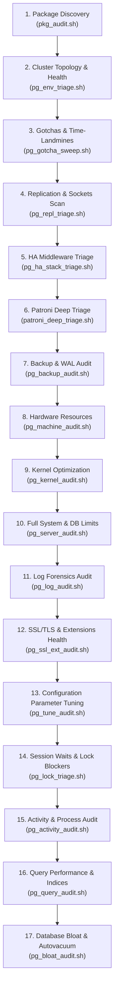

# PostgreSQL Support & Diagnostics Suite

This repository contains a curated set of runbooks, reference documentation, and portable, read-only diagnostic scripts designed to triage, audit, and tune PostgreSQL database environments on Linux systems.

## Purpose

To provide a production-ready, version-controlled reference for database administrators and support engineers. These tools and playbooks enable quick problem resolution, hardware/software compatibility auditing, and database configuration validation without altering system state.

---

## Repository Structure

*   **[scripts/](file:///home/josef/github.com/josmac69/postgresql_support_docs/scripts/README.md)**: Zero-dependency, read-only diagnostic utilities (described below).
*   **[PostgreSQL/](file:///home/josef/github.com/josmac69/postgresql_support_docs/PostgreSQL/README.md)**: Master reference manuals, playbooks, configuration guides, upgrades, and autovacuum tuning docs.
*   **[Patroni/](file:///home/josef/github.com/josmac69/postgresql_support_docs/Patroni/README.md)**: Three-node Patroni high-availability Docker sandbox and technical research.
*   **[Linux_tools/](file:///home/josef/github.com/josmac69/postgresql_support_docs/Linux_tools/README.md)**: GDB debugging, perf profiling, and OS-level sysctl kernel tuning.
*   **[Barman/](file:///home/josef/github.com/josmac69/postgresql_support_docs/Barman/README.md)**: Disaster recovery and WAL streaming manuals for Barman.
*   **[pgBackRest/](file:///home/josef/github.com/josmac69/postgresql_support_docs/pgBackRest/README.md)**: Parallel backup and restore architecture guide.
*   **[repmgr/](file:///home/josef/github.com/josmac69/postgresql_support_docs/repmgr/README.md)**: PostgreSQL replication manager failover internals.
*   **[wal-g/](file:///home/josef/github.com/josmac69/postgresql_support_docs/wal-g/README.md)**: WAL-G block-level compressed backup internals.
*   **[streaming_replication/](file:///home/josef/github.com/josmac69/postgresql_support_docs/streaming_replication/README.md)**: Core code-level references on streaming replication.
*   **[Distributed_Configuration_Store_(DCS)/](file:///home/josef/github.com/josmac69/postgresql_support_docs/Distributed_Configuration_Store_(DCS)/README.md)**: etcd, Consul, and ZooKeeper consensus comparisons.
*   **[kubernetes_operators/](file:///home/josef/github.com/josmac69/postgresql_support_docs/kubernetes_operators/README.md)**: CloudNativePG and Percona Operator architectural comparisons.
*   **[EDB_MTK/](file:///home/josef/github.com/josmac69/postgresql_support_docs/EDB_MTK/README.md)**: EDB Postgres Migration Toolkit dockerized lab and CLI wrappers.
*   **[EDB_PEM/](file:///home/josef/github.com/josmac69/postgresql_support_docs/EDB_PEM/README.md)**: EDB Postgres Enterprise Manager dockerized monitoring stack.
*   **[liquibase/](file:///home/josef/github.com/josmac69/postgresql_support_docs/liquibase/README.md)**: Liquibase schema migration dockerized lab.
*   **[MySQL/](file:///home/josef/github.com/josmac69/postgresql_support_docs/MySQL/README.md)**: MySQL comparison report for PostgreSQL DBA specialists and Paxos Group Replication.
*   **[NoSQL/](file:///home/josef/github.com/josmac69/postgresql_support_docs/NoSQL/README.md)**: MongoDB to PostgreSQL migration case studies.
*   **[AI_tools/](file:///home/josef/github.com/josmac69/postgresql_support_docs/AI_tools/README.md)**: Claude hidden features and PostgreSQL AI extensions catalog.
*   **[miscellaneous/](file:///home/josef/github.com/josmac69/postgresql_support_docs/miscellaneous/README.md)**: Cloud updates, nested learning, and RESTful API guides.

---

## Diagnostic & Auditing Toolkit

All scripts located in the `scripts/` directory are **strictly read-only** by default. They analyze system configurations, collect statistics, and print recommendations (including exact remediation command blocks) without altering the target system.

### Recommended Diagnostic Workflow (Run Order)

When triaging an unfamiliar host or debugging a performance incident, run the diagnostic scripts in this progressive sequence:



#### Phase 1: Environment & Package Discovery
1.  **`pkg_audit.sh`**: Identifies installed software packages, OS versions, conflicts, competing engines, and missing debugging/diagnostic utilities.
2.  **`pg_env_triage.sh`**: Identifies the database deployment architecture (VM vs. Patroni Cluster vs. Kubernetes Operator) and fingerprints open ports, replication sync status, and DCS health.
3.  **`pg_gotcha_sweep.sh`**: Scans for classic administration traps: un-restarted GUC changes, custom `postgresql.auto.conf` shadows, ordering issues in `pg_hba.conf`, active mounted partitions missing from `/etc/fstab`, NTP clock drift, upcoming scheduled cron/systemd jobs, and risky `logrotate` settings.
4.  **`pg_repl_triage.sh`**: Evaluates standby/primary replication logs, parameters, replication slots, and performs TCP socket sweeps on peer hosts to identify network connectivity blocks.
5.  **`pg_ha_stack_triage.sh`**: Audits the high-availability middleware components, including Patroni REST APIs, etcd endpoint health and cluster alarms, HAProxy configurations and backends, and keepalived VIP status.
6.  **`patroni_deep_triage.sh`**: Conducts a deep, node-level audit of the Patroni daemon: YAML vs. environment configurations, REST API endpoints, local status vs. DCS dynamic truth, quorum/member lags, watchdog devices, and log forensics.
7.  **`pg_backup_audit.sh`**: Audits backup configuration, WAL archiving health, backup repository status (pgBackRest/Barman/WAL-G), and data page checksums.

#### Phase 2: Host & OS Configuration Audit
8.  **`pg_machine_audit.sh`**: Audits physical hardware allocations (CPU governors, RAM overhead, storage mount parameters) and measures baseline disk performance.
9.  **`pg_kernel_audit.sh`**: Audits virtual memory settings, Huge Pages, and SysV IPC limits, then exports ready-to-use sysctl overrides.
10. **`pg_server_audit.sh`**: Audits OS-level process limit constraints (such as `LimitNOFILE` and `oom_score_adj`), systemd service status, authentication rules (`pg_hba.conf`), and database health flags.
11. **`pg_log_audit.sh`**: Scans PostgreSQL server logs and system journal logs for OOM events, database crashes, PANICs, deadlock events, and log GUC settings.

#### Phase 3: PostgreSQL Instance & Performance Tuning
12. **`pg_ssl_ext_audit.sh`**: Audits SSL/TLS encryption parameters, certificate validation dates, plaintext `pg_hba.conf` transport vulnerabilities, extension versions (installed vs available), and preloaded libraries consistency.
13. **`pg_tune_audit.sh`**: Reviews active database parameter settings against target workload profiles (OLTP vs. DW) and actual CPU/RAM capacity.
14. **`pg_lock_triage.sh`**: Triages active query status, wait events, slow-running queries, idle-in-transaction, and lock wait blocks hierarchy (generating backend termination commands).
15. **`pg_activity_audit.sh`**: Audits database process capacity, client connections skew, prepared transactions (2PC), and runaway background worker processes.
16. **`pg_query_audit.sh`**: Audits slow queries (using pg_stat_statements), index coverage, sequential scans, duplicate/invalid indexes, and planner statistics.
17. **`pg_bloat_audit.sh`**: Runs in-database diagnostics to audit autovacuum cost throttle policies, memory limits, and estimates relation storage waste.

---

### Toolkit Summary

| Script Name | Target Layer | Primary Checks | Execution Level |
| :--- | :--- | :--- | :--- |
| **`pkg_audit.sh`** | Packages / Distro | PostgreSQL multi-version conflicts, competing engines, missing debug tools | Non-root (degrades gracefully) |
| **`pg_env_triage.sh`** | Cluster / Topology | Identifies deployment type (plain VM, Patroni VM, Kubernetes operators) and layer health | Non-root (degrades gracefully) |
| **`pg_gotcha_sweep.sh`** | Config / Environment | GUC restarts, auto.conf overrides, fstab reboots, NTP clock sync, cron conflicts | Root (sudo) recommended |
| **`pg_repl_triage.sh`** | Replication / Net | Standby/primary LSN lag, receiver states, slot audits, peer TCP socket connection checks | Non-root (DB connectivity required) |
| **`pg_ha_stack_triage.sh`** | HA / Middleware | Patroni cluster/DCS, etcd member quorum/alarms, HAProxy backends, keepalived VIP | Non-root (configs benefit from sudo) |
| **`patroni_deep_triage.sh`** | HA / Patroni | YAML/env configs, REST role endpoints, DCS quorums, member lags, watchdogs, logs | Non-root (sudo suggested for configs/logs) |
| **`pg_backup_audit.sh`** | Backups / WAL | WAL archiving health, pgBackRest/Barman status, data checksums, WAL backlog | Non-root (sudo suggested for backlog check) |
| **`pg_machine_audit.sh`** | Hardware / Host OS | CPU topology, RAM utilization, page table size, disk type, I/O rates | Non-root (benchmarks require write access) |
| **`pg_kernel_audit.sh`** | Kernel / Sysctl | Virtual memory, Huge Pages, SysV IPC limits, active process descriptor caps | Non-root (some keys require root read) |
| **`pg_server_audit.sh`** | Full System & DB | Combines OS, disk space, limits, systemd units, pg_hba rules, vacuum status | Root (sudo) recommended |
| **`pg_log_audit.sh`** | Logs / OS Events | Scans server logs & dmesg for ERROR/PANIC, OOM kills, deadlocks, checks log settings | Root (sudo) recommended to access logs |
| **`pg_ssl_ext_audit.sh`** | SSL / Extensions | SSL config, TLS protocols, certificate expiry, plain pg_hba, stale extension versions | Non-root (DB connectivity required) |
| **`pg_tune_audit.sh`** | PostgreSQL Config | Heuristically compares active PG configurations against host hardware profile | Non-root / Config file parser |
| **`pg_lock_triage.sh`** | Sessions / Locks | Active session states, wait events, query duration, root lock blocker PIDs | Non-root (DB connectivity required) |
| **`pg_activity_audit.sh`** | Sessions / Activity | Connection limits, skew by client IP/user, idle-in-TX, prepared transactions | Non-root (DB connectivity required) |
| **`pg_query_audit.sh`** | Database / SQL | pg_stat_statements stats, seq scan tables, unused/duplicate/invalid index checks | Non-root (DB connectivity required) |
| **`pg_bloat_audit.sh`** | Database / Bloat | Estimates table/index bloat, checks autovacuum cost limit/delay, generates plan | Non-root (DB connectivity required) |

---

### Detailed Script Overviews & Usage

#### 1. Package Auditor (`pkg_audit.sh`)
*   **What it checks**:
    *   Inventories database packages and client tools.
    *   Detects multiple concurrently installed PostgreSQL versions.
    *   Identifies resource-competing engines (e.g. MySQL, MongoDB, Redis) on the host.
    *   Audits availability of critical troubleshooting utilities (`sysbench`, `strace`, `tcpdump`, `gdb`, `perf`, `bpftrace`).
*   **How to run**:
    ```bash
    bash scripts/pkg_audit.sh | tee pkg_audit_$(hostname).log
    # Or via the symlink:
    "./Linux_support/pkg_audit.sh" | tee pkg_audit_$(hostname).log
    ```

#### 2. Environment Triager (`pg_env_triage.sh`)
*   **What it checks**:
    *   Fingerprints ports and processes to auto-classify the database architecture.
    *   **Kubernetes Layer**: Detects K8s environments, node states, and operators (Percona v2, Crunchy, Zalando, CNPG), pod restarts, and PVC bindings.
    *   **Patroni / High-Availability**: Inspects REST API on `:8008`, cluster state/timeline sync, and etcd/consul DCS health.
    *   **Database Health**: Checks replication slots lag, wal_receiver, checkpoint frequencies, and XID age.
*   **How to run**:
    ```bash
    bash scripts/pg_env_triage.sh | tee env_triage_$(hostname).log
    ```

#### 3. Gotchas & Time-Landmines Sweeper (`pg_gotcha_sweep.sh`)
*   **What it checks**:
    *   **Restart Pending GUCs**: Checks `pg_settings` for configuration settings that have been changed but require a server restart to take effect.
    *   **Auto Config Overrides**: Inspects `postgresql.auto.conf` for overrides that might shadow setting changes in the main `postgresql.conf` file, and flags hand-edited tampering signatures.
    *   **pg_hba.conf Ordering Traps**: Audits the client authentication file rules to identify shadowing issues (like a broad `reject` or `trust` rule matching first and bypassing intended rules).
    *   **Reboot Mount Survival**: Correlates active mounted disk volumes containing PostgreSQL data directories against `/etc/fstab` and systemd mount units to ensure storage mounts survive a host reboot.
    *   **Time & NTP Sync**: Verifies that the system clock timezone is correct and NTP sync status is active to prevent transactional log replication or timezone tracking anomalies.
    *   **Scheduled Job Collisions**: Lists systemd timers and cron entries scheduling heavy jobs (e.g. system upgrades, backups, scrubs) within a custom lookahead window (default 4 hours) that could impact live DB operations.
    *   **Logrotate Collisions**: Audits logrotate configurations covering PostgreSQL logs, highlighting options like `copytruncate` which can temporarily disrupt open tail file sessions.
*   **How to run**:
    ```bash
    # Runs best with sudo to inspect fstab, logrotate and timer definitions:
    sudo bash scripts/pg_gotcha_sweep.sh | tee gotcha_sweep_$(hostname).log
    # Customize the scheduled jobs lookahead window (e.g., check next 12 hours):
    sudo bash scripts/pg_gotcha_sweep.sh --lookahead 12 | tee gotcha_sweep_$(hostname).log
    ```

#### 4. Replication & Network Auditor (`pg_repl_triage.sh`)
*   **What it checks**:
    *   Audits instance replication recovery state (Primary vs. Standby).
    *   Checks local config variables (`wal_level`, `max_wal_senders`, `max_replication_slots`, `hot_standby`).
    *   Queries replication views (`pg_stat_replication` or `pg_stat_wal_receiver`) and active replication slots.
    *   Scans `/etc/hosts` and Patroni YAML parameters for peer addresses.
    *   Performs non-blocking TCP socket probes on peer hosts to check critical ports (`5432`, `6432`, `8008`, `2379`).
    *   Generates a standby re-cloning (`pg_basebackup`) and timeline sync (`pg_rewind`) remediation playbook.
*   **How to run**:
    ```bash
    # Autodetect hosts and test connections:
    bash scripts/pg_repl_triage.sh | tee repl_triage_$(hostname).log
    # Scan explicit target peer IP addresses:
    bash scripts/pg_repl_triage.sh --peers 10.0.0.10,10.0.0.11 | tee repl_triage_$(hostname).log
    ```

#### 5. HA Middleware Triager (`pg_ha_stack_triage.sh`)
*   **What it checks**:
    *   **Component Discovery**: Auto-detects active presence and systemd states of Patroni, etcd, HAProxy, pgBouncer, and keepalived.
    *   **Patroni Health**: Audits member role (Primary/Replica), cluster state, timeline synchronization, replication lag, cluster pause states, and checks if DCS timing configurations (`ttl` >= `loop_wait` + 2 * `retry_timeout`) satisfy safety guidelines.
    *   **etcd DCS Health**: Verifies endpoint responsiveness, member counts (warns on even numbers), and queries active etcd alarms (such as `NOSPACE` errors that freeze metadata updates).
    *   **HAProxy Load Balancer**: Performs configuration validation checks, parses Patroni role-awareness check paths (e.g., `/primary` vs `/replica`), and queries the HAProxy stats socket for backend node statuses.
    *   **pgBouncer Connection Pooler**: Audits connection limits, pool modes (session vs transaction), authentication security rules, and queries the admin console for client queuing and pool saturation statistics.
    *   **keepalived & VIP**: Identifies configured virtual IP addresses and reports whether this node is currently the master or backup.
*   **How to run**:
    ```bash
    # Run with auto-discovery (runs best with sudo for config reading):
    sudo bash scripts/pg_ha_stack_triage.sh | tee ha_triage_$(hostname).log
    # Specify custom endpoints/ports:
    sudo bash scripts/pg_ha_stack_triage.sh --patroni-url http://127.0.0.1:8008 --etcd http://10.0.0.10:2379 --pgb-port 6432 | tee ha_triage_$(hostname).log
    ```

#### 6. Patroni Deep Auditor (`patroni_deep_triage.sh`)
*   **What it checks**:
    *   **Process & Container Isolation**: Auto-detects if Patroni is running under a systemd unit or within container environments (Docker/Podman). If containerized, it scans stack siblings (etcd/consul/HAProxy/pgBouncer) and verifies container restart policies.
    *   **Orphaned Instances**: Pinpoints PostgreSQL processes running without active supervisor daemons, highlighting split-brain and metadata expiry vulnerabilities.
    *   **YAML vs Env Configs**: Audits the precedence chain between YAML configurations, dynamic DCS `/config` keys, and `PATRONI_*` environment variables.
    *   **REST Role Invariant**: Cross-references local role claims with actual GET status endpoints (`/primary`, `/replica`, `/read-only`) to find routing mismatches.
    *   **DCS Quorum Lags**: Measures membership offsets and checks if DCS timing configurations (`ttl` >= `loop_wait` + 2 * `retry_timeout`) satisfy safety guidelines.
    *   **Fencing Watchdogs**: Audits watchdog devices (`/dev/watchdog` / `softdog`) and checks group permissions and container pass-through devices.
    *   **Log Forensics**: Scans last 24h of unit/container logs for self-demotions, DCS connection drops, system ID mismatches, and `pg_rewind` errors.
*   **How to run**:
    ```bash
    # Run with default REST API URL:
    sudo bash scripts/patroni_deep_triage.sh | tee patroni_deep_$(hostname).log
    # Target a specific remote REST endpoint and config file:
    sudo bash scripts/patroni_deep_triage.sh --url http://10.0.0.10:8008 --config /etc/patroni/patroni.yml | tee patroni_deep_$(hostname).log
    ```

#### 7. Backup & WAL Auditor (`pg_backup_audit.sh`)
*   **What it checks**:
    *   WAL archiving parameters (`archive_mode`, `archive_command`, `archive_library`, `wal_level`).
    *   Archiver runtime health (failed count, last archive time, and `.ready` files backlog in `pg_wal`).
    *   Installed backup software (pgBackRest stanzas, Barman server status, WAL-G availability).
    *   Existing backup jobs scheduled in cron files or systemd timers.
    *   Database page checksum configuration and recorded checksum failures (`pg_stat_database`).
    *   Recovery-related parameters (`restore_command`, `recovery_target_time`, checkpoint timeouts).
*   **How to run**:
    ```bash
    # Run with default database connection settings:
    bash scripts/pg_backup_audit.sh | tee backup_audit_$(hostname).log
    ```

#### 8. Machine Resources Auditor (`pg_machine_audit.sh`)
*   **What it checks**:
    *   CPU governor settings (checks for `performance` scaling).
    *   Physical memory layout, swap usage, and Linux Page Table size (VmPTE + VmPMD) overhead.
    *   Transparent Huge Pages (THP) and virtual memory mounts (`/dev/shm` / `/tmp`).
    *   Disk mount options (flags absence of `noatime` on data directories) and real-time block device I/O load.
    *   *Optional benchmark*: Runs active sequential disk read/write throughput speeds.
*   **How to run**:
    ```bash
    bash scripts/pg_machine_audit.sh | tee machine_audit_$(hostname).log
    # With active disk I/O performance benchmarking:
    bash scripts/pg_machine_audit.sh --benchmark | tee machine_benchmark_$(hostname).log
    ```

#### 9. Kernel sysctl Auditor (`pg_kernel_audit.sh`)
*   **What it checks**:
    *   Memory limits: `vm.swappiness`, `vm.overcommit_memory`, `vm.dirty_background_ratio`, and `vm.dirty_ratio` (tuned for smooth checkpoint writeouts).
    *   Zone reclaim behavior on NUMA architectures (`vm.zone_reclaim_mode`).
    *   IPC shared memory: `kernel.shmmax`, `kernel.shmall`, and SysV semaphore values.
    *   System file descriptors limit (`fs.file-max`) and asynchronous I/O capacity (`fs.aio-max-nr`).
*   **How to run**:
    ```bash
    bash scripts/pg_kernel_audit.sh | tee kernel_audit_$(hostname).log
    # Generate and apply a sysctl configuration snippet for flags/FIXMEs (Debian & RedHat):
    bash scripts/pg_kernel_audit.sh --sysctl | sudo tee /etc/sysctl.d/99-postgresql.conf
    ```

#### 10. Systems & Instance Auditor (`pg_server_audit.sh`)
*   **What it checks**:
    *   High-level operating system metrics, load, and disk inode exhaustion.
    *   Failed systemd units and dmesg kernel logs for recent OOM killer events.
    *   Postmaster service configurations, boot status, open-file limits (`LimitNOFILE`), and `oom_score_adj`.
    *   PostgreSQL runtime environment: key parameters (`shared_buffers`, `work_mem`), `fsync`/`full_page_writes` protection, replica lag, security and role validation (open network or `trust` peer entries in `pg_hba.conf`).
*   **How to run**:
    ```bash
    sudo bash scripts/pg_server_audit.sh | tee server_audit_$(hostname).log
    ```

#### 11. Log Forensics Auditor (`pg_log_audit.sh`)
*   **What it checks**:
    *   Locates active log files (file, csvlog) and systemd journald logs.
    *   Scans logs for PANIC/FATAL crashes, crash recovery timelines, and signals.
    *   Detects database and kernel-level OOM actions, file limits, and disk space exhaustion.
    *   Audits transaction pathologies like deadlocks and long lock wait warnings.
    *   Aggregates the top 10 most frequent ERROR messages.
    *   Audits logging configurations (`log_checkpoints`, `log_lock_waits`, `log_temp_files`, `log_min_duration_statement`, `log_line_prefix`).
*   **How to run**:
    ```bash
    # Run with default database connection settings (requires sudo to access log folders):
    sudo bash scripts/pg_log_audit.sh | tee log_audit_$(hostname).log
    # Set custom window and limit sample rows:
    sudo bash scripts/pg_log_audit.sh --hours 12 --lines 10 | tee log_audit_$(hostname).log
    ```

#### 12. SSL/TLS & Extensions Health Auditor (`pg_ssl_ext_audit.sh`)
*   **What it checks**:
    *   **SSL Settings**: Audits GUC parameters (`ssl`, `ssl_ciphers`, protocols, etc.) and flags insecure protocol configurations (e.g., TLSv1/TLSv1.1).
    *   **Certificates Expiry**: Probes configured SSL server and CA certificate files, validating readability, subject info, and expiration dates.
    *   **Network Encryption Exposure**: Audits `pg_hba.conf` rules to check for wide network subnet ranges permitting unencrypted connections (`host` rules instead of `hostssl` rules).
    *   **Extension Catalog Upgrades**: Inventories installed extension catalog entries against their available version binaries on disk to identify stale versions requiring upgrades (common after `pg_upgrade`).
    *   **Preload Libraries Consistency**: Correlates GUC `shared_preload_libraries` entries with actual extension catalog registrations to highlight resource wastage or missing catalog installations.
*   **How to run**:
    ```bash
    # Run with default database connection settings (scans 5432-5435 if port not set):
    sudo bash scripts/pg_ssl_ext_audit.sh | tee ssl_ext_audit_$(hostname).log
    # Target a specific port, db, and set custom certificate warnings threshold (e.g., 60 days):
    sudo bash scripts/pg_ssl_ext_audit.sh --port 5432 --dbname postgres --cert-warn 60 | tee ssl_ext_audit_$(hostname).log
    ```

#### 13. Configuration Tuner (`pg_tune_audit.sh`)
*   **What it checks**:
    *   Queries host memory, cores, and disk speed to dynamically calculate an optimal PostgreSQL profile.
    *   Compares the active database parameters or an offline `postgresql.conf` file against calculated OLTP, Web, or DW heuristics.
    *   Flags misconfigurations on memory caches, background writers, and worker pools.
*   **How to run**:
    ```bash
    # Audits running local database:
    bash scripts/pg_tune_audit.sh | tee tune_audit_$(hostname).log
    # Audits running local database against an OLTP profile with 200 connection target:
    bash scripts/pg_tune_audit.sh --profile oltp --connections 200 | tee tune_audit_$(hostname).log
    # Audits an offline config file (Debian/Ubuntu):
    bash scripts/pg_tune_audit.sh --conf /etc/postgresql/17/main/postgresql.conf | tee tune_audit_$(hostname).log
    # Audits an offline config file (RHEL/Rocky/Alma):
    bash scripts/pg_tune_audit.sh --conf /var/lib/pgsql/17/data/postgresql.conf | tee tune_audit_$(hostname).log
    ```

#### 14. Lock Contention & Session Triager (`pg_lock_triage.sh`)
*   **What it checks**:
    *   Summarizes active, idle, and idle-in-transaction session counts.
    *   Identifies wait event type and details for active queries.
    *   Highlights long-running queries (>5s) and idle-in-transaction sessions.
    *   Analyzes lock contention to print a hierarchical wait tree of blocked and blocking PIDs.
    *   Audits granted relation locks on tables.
    *   Generates exact SQL cancel (`pg_cancel_backend`) and termination (`pg_terminate_backend`) commands for root blockers.
*   **How to run**:
    ```bash
    # Run with default database connection settings:
    bash scripts/pg_lock_triage.sh | tee lock_triage_$(hostname).log
    # Customize alert timeout threshold (e.g. query alerts on > 10 seconds):
    bash scripts/pg_lock_triage.sh --timeout 10 | tee lock_triage_$(hostname).log
    ```

#### 15. Activity & Process Auditor (`pg_activity_audit.sh`)
*   **What it checks**:
    *   Connection limit capacity and current pool saturation (alerts on >=70% or >=85% usage).
    *   Connection load distributions skewed by client IP addresses and database users.
    *   Flags idle-in-transaction processes older than a custom threshold (default 5s).
    *   Flags active client queries running longer than a custom threshold (default 10s).
    *   Tracks sessions currently blocked and waiting on database relation locks.
    *   Audits prepared transactions (`pg_prepared_xacts`) older than 5 minutes that cause table bloat by blocking VACUUM cleanups.
    *   Identifies runaway autovacuum background workers taking longer than 15 minutes.
    *   Generates clean SQL commands to cancel queries, terminate processes, and roll back prepared transactions.
*   **How to run**:
    ```bash
    # Run with default database connection settings:
    bash scripts/pg_activity_audit.sh | tee activity_audit_$(hostname).log
    # Customize alert thresholds (e.g. idle-in-tx > 10s, queries > 20s, prepared > 10m):
    bash scripts/pg_activity_audit.sh --idle-tx 10 --long-query 20 --prepared 10 | tee activity_audit_$(hostname).log
    ```

#### 16. Query Performance & Index Auditor (`pg_query_audit.sh`)
*   **What it checks**:
    *   Extension availability of `pg_stat_statements` and inventories top resource-intensive queries by runtime, mean latency, and block I/O.
    *   Detects large tables experiencing high volumes of sequential scans (missing index candidates).
    *   Lists unused indexes that cause unnecessary write amplification and storage waste.
    *   Identifies exact duplicate indexes (same key columns and expressions).
    *   Locates invalid indexes caused by aborted `CONCURRENTLY` builds.
    *   Finds tables missing primary keys (issues with ORMs or replication).
    *   Audits stale planner stats (ANALYZE age) and overall cache buffer hit ratios.
*   **How to run**:
    ```bash
    # Run with default database connection settings:
    bash scripts/pg_query_audit.sh | tee query_audit_$(hostname).log
    # Customize sequential scan size/count thresholds and top query counts:
    bash scripts/pg_query_audit.sh --min-size 20 --min-scans 5000 --top 15 | tee query_audit_$(hostname).log
    ```

#### 17. Bloat & Autovacuum Auditor (`pg_bloat_audit.sh`)
*   **What it checks**:
    *   Estimates table and B-Tree index bloat sizes and percentages.
    *   Performs dependency checking for memory safety (`autovacuum_work_mem` vs `maintenance_work_mem` OOM limits).
    *   Audits autovacuum cost throttle policies (total limit units divided by parallel worker pools).
    *   Lists custom table-level vacuum overrides and identifies large tables (>1GB) running on standard scale factors.
    *   Generates a safe SQL remediation plan (`REINDEX CONCURRENTLY` and custom table overrides).
*   **How to run**:
    ```bash
    # Run with default environment connection parameters:
    bash scripts/pg_bloat_audit.sh | tee bloat_audit_$(hostname).log
    # Target a specific remote port and customize reporting thresholds (e.g. 20% bloat, 5MB size):
    bash scripts/pg_bloat_audit.sh --port 5433 --threshold 20 --min-size 5 | tee bloat_audit_$(hostname).log
    ```

---
*Last Updated: 2026-07-08*